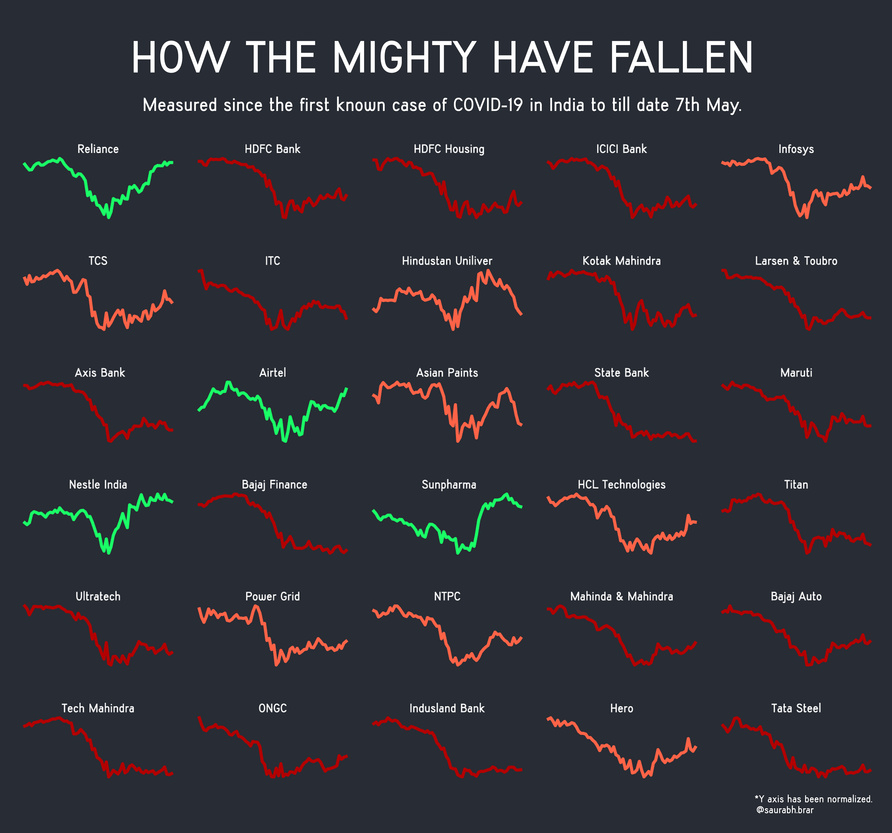

Red indicates that stock has fallen more than 25%.  
Orange indicates that the stock has fallen less than 25%. 
Green indicates that stock has actually increased since the date first case was discovered. 

